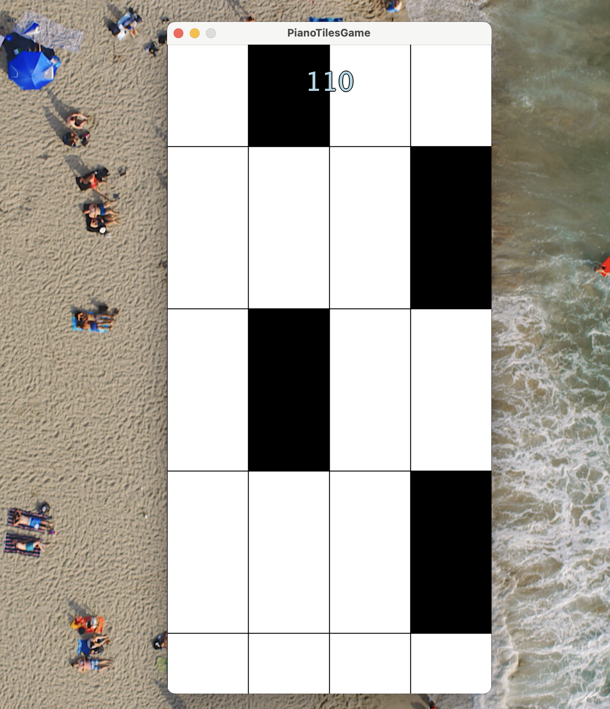

# Don’t Tap the White

In this game, you aim to click on black tiles as they scroll down the screen, 
while avoiding white tiles. The game speeds up as your score increases, making
it progressively more challenging.

## Features

* The tiles continuously scroll down, and you need to click on black tiles to keep the game going
* You gain points by tapping the black tiles
* The score and speed increase as you play, and even more so after certain thresholds
* The game ends if you accidentally tap a white tile or miss a black tile at the bottom of the screen 
* And of course you can hear the piano tiles while you play

## How to Run

To run the game:

Just click “Run” on the PianoTilesGame.scala file to start the game.

## Showcase

Video gameplay
https://www.canva.com/design/DAGUuXZcsJY/bTU4GdnaKewWjITxD5cyyQ/watch?utm_content=DAGUuXZcsJY&utm_campaign=share_your_design&utm_medium=link&utm_source=shareyourdesignpanel

Screenshot
